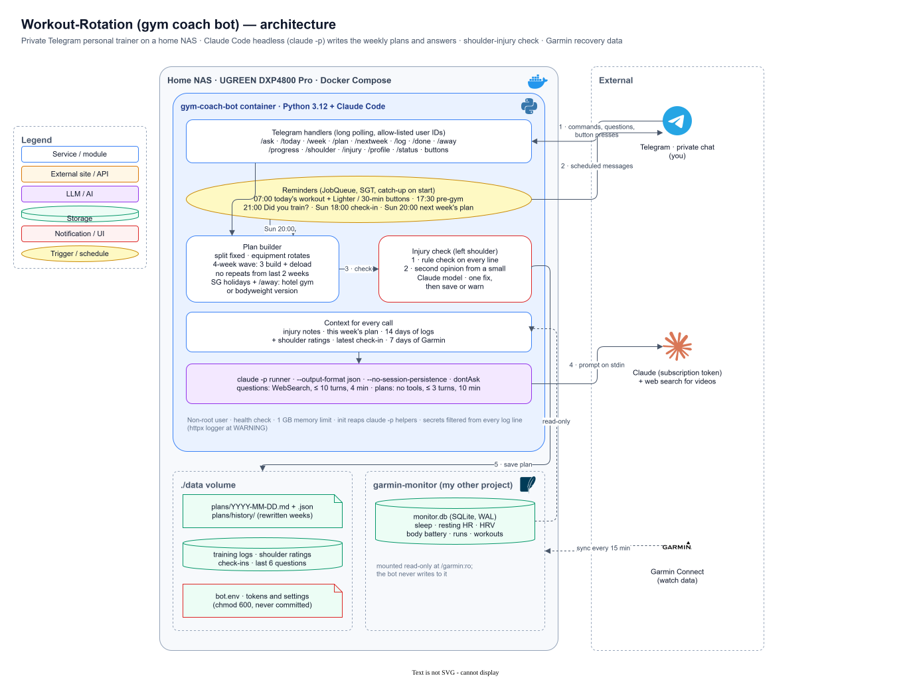

# Gym coach bot

A private Telegram bot that coaches you like a personal trainer. It runs in Docker on your UGREEN NAS and uses Claude Code in headless mode (`claude -p`) for all its AI. Your Claude subscription pays for it, so no API billing is needed.

- Answers training questions (`/coach`, or just write to it), with web search for real videos.
- Builds a full 7-day plan every week. Monday to Wednesday are upper body days with one body part each (chest, back, shoulders, arms). Each body part moves one day earlier every week, so with four parts on three days one sits out each week in turn. The exercises change every week. The main equipment rotates (dumbbells, cables, machines, barbell and kettlebells). Effort follows a 4-week wave: three building weeks, then a deload.
- Protects your left shoulder. Every new plan is checked for movements your injury rules leave out, first by a rule check and then by a quick second opinion from a small Claude model. If anything slips in, Claude fixes the plan once before it's saved.
- Sends that day's workout every morning, with buttons for a lighter or a 30-minute version. It reminds you again before the gym and checks at 9pm whether you trained. On Sunday it asks how the week went, then builds next week's plan from your answer.
- Reads your sleep, resting heart rate, HRV, body battery, runs and workouts from your garmin-monitor app. It warns you when your recovery looks low, and marks the day done when your watch recorded a workout.
- Knows Singapore public holidays and the days you're away (`/away`), and plans a hotel gym or bodyweight version for them.
- Tracks the weights you log (`/progress`), sends your shoulder ratings as a spreadsheet file for your physio, and adds "last week in numbers" to the Sunday overview.

## How it fits together



1. **You** talk to the bot in a private Telegram chat: commands, questions and button presses.
2. **Reminders** run on a schedule (Singapore time) and message you: the day's workout, the pre-gym nudge, the 9pm check and the Sunday check-in.
3. **The plan builder** writes next week's plan every Sunday, and **the injury check** reviews every line against your shoulder rules before it's saved.
4. **Every AI call** runs `claude -p` with your injury notes, this week's plan, recent logs, shoulder ratings and 7 days of Garmin data.
5. **Plans, logs and check-ins** are saved as plain files in `./data`. garmin-monitor's `monitor.db` is only ever read.

To edit the diagram, open `docs/architecture.drawio.svg` in [draw.io](https://app.diagrams.net) (File → Open from → Device) or in VS Code with the Draw.io Integration extension. Save it in the same format, and GitHub shows the updated picture.

## Files

| File | What it is |
|---|---|
| `bot.py` | The bot |
| `requirements.txt` | Python packages |
| `Dockerfile` | Python 3.12 slim image with Claude Code (native installer), running as a normal user with a health check |
| `entrypoint.sh` | Gives the bot's user its folders, then starts the bot as that user |
| `compose.yaml` | The container, the `./data` folder and a read-only mount of garmin-monitor's data |
| `bot.env.example` | Every personal setting. Copy it to `bot.env` |
| `tests/` | Tests with a fake `claude`, a fake Telegram and sample Garmin data |
| `.github/workflows/ci.yml` | On every push, GitHub runs the tests, builds the real image and runs the end-to-end check against it |

## Setup on the NAS (DXP4800 Pro, UGOS Pro)

1. **Get a Claude token.** On your own computer (with Claude Code installed), run `claude setup-token` and sign in with your Claude subscription. Copy the token, which starts with `sk-ant-oat01-`, and note today's date. The token lasts one year.
2. **Create the Telegram bot.** In Telegram, message **@BotFather**, send `/newbot`, and copy the bot token.
3. **Copy this folder to the NAS**, for example to `/volume1/docker/gym-coach` using the UGOS Files app or `scp`.
4. **Fill in `bot.env`.** Copy `bot.env.example` to `bot.env` in the same folder, then set:
   - `TELEGRAM_BOT_TOKEN`
   - `CLAUDE_CODE_OAUTH_TOKEN`
   - `CLAUDE_TOKEN_CREATED`, the date from step 1

   Leave `ALLOWED_USER_IDS` empty for now. Check the other settings too: about you, reminder times and basketball days. Don't put ` #` or `$` inside a value, because Docker reads them specially. Then run `chmod 600 bot.env`, since the file holds your tokens.

   The bot runs as a normal user, not root. Set `PUID` and `PGID` to your NAS account's numbers, so the files in `./data` belong to you. Over SSH, `id` shows them (for example `uid=1000 gid=10`).
5. **Check the Garmin path.** `compose.yaml` mounts `/volume1/docker/garmin-monitor/data` read-only. Change that line if garmin-monitor lives somewhere else. In `bot.env`, `GARMIN_PROFILE` must match the profile name in garmin-monitor's `config.yaml` (default `Me`).
6. **Start it.** Enable SSH in UGOS (Control Panel → Terminal), connect, and run:
   ```sh
   cd /volume1/docker/gym-coach
   sudo docker compose up -d --build
   ```
7. **Send `/whoami` to your bot in a private chat.** Until your ID is allowed, it replies with your Telegram user ID. The bot only works in private chats. To stop it from being added to groups, send `/setjoingroups` to @BotFather and choose Disable.
8. **Add your ID** to `ALLOWED_USER_IDS` in `bot.env`, then run `sudo docker compose up -d` again to apply the change. A plain `restart` does not reload `bot.env`. The first ID in the list gets the reminders.
9. **Send `/plan`.** The first plan takes a minute or two. The week you send it becomes week 1.

**Back up `./data`.** It holds your plans, logs, shoulder ratings and check-ins. Add `/volume1/docker/gym-coach/data` to your NAS backup task (Sync & Backup app). `bot.env` holds your tokens, so keep a private copy somewhere safe.

## Test Claude Code inside the container

```sh
# version and sign in, as the user the bot runs as
sudo docker exec -u coach gym-coach-bot claude --version
sudo docker exec -u coach gym-coach-bot claude auth status

# one real call, the same way the bot makes them (from the empty /work folder)
sudo docker exec -u coach -w /work gym-coach-bot sh -c \
  'echo "Reply with five words about squats" | claude -p --output-format json --no-session-persistence --permission-mode dontAsk --model sonnet --tools ""'

# health (the NAS Docker app shows the same) and bot logs (tokens are never written to them)
sudo docker inspect --format '{{.State.Health.Status}}' gym-coach-bot
sudo docker logs --tail 100 gym-coach-bot
```

In the JSON reply, `"is_error": false` and a `result` text mean everything works. `/status` in Telegram shows the version, sign-in, the last plan and the next reminders. `claude auth status` only proves a token is set, not that it's still valid, so `/status` also shows whether the last real Claude call worked.

## Commands

| Command | What it does |
|---|---|
| `/coach <question>` | Ask the coach (`/ask` works too). In a private chat, a plain message works too. It remembers your last 6 questions. |
| `/today` | Today's workout card (see "Workout cards" below) |
| `/day <day>` | Any day's workout card, for example `/day fri`. Once a day has passed and next week is built, it shows next week's. |
| `/week` | The week in short: each day's body parts with sets, reps and weights. On Saturday and Sunday it shows next week's if it's built. |
| `/plan [notes]` | Rebuild this week's plan with your notes, for example `/plan travelling Thu and Fri` |
| `/nextweek [notes]` | Build next week's plan now |
| `/log <what you did>` | Save it with today's date, for example `/log rows 22kg 3x10, floor press 14kg 3x8 felt easy`. `/log` alone lists the last 2 weeks. |
| `/done` | Mark today's session finished, then rate your left shoulder 0 to 10 with the buttons |
| `/shoulder` | Your full shoulder rating log with a weekly chart, plus a CSV file for your physio. `/shoulder 3` saves a rating. |
| `/progress` | The weights and reps from your logs, per exercise, first to latest |
| `/injury [notes]` | Show or replace your injury notes. `/injury none` clears them. |
| `/away [dates] [note]` | Days away, on leave or travelling, for example `/away 8 Oct to 10 Oct Bangkok trip` or `/away thu fri`. `/away` lists them with upcoming public holidays, and `/away clear` removes them. |
| `/profile` | What the coach knows about you, including your shoulder trend and Garmin data |
| `/gymstatus` | (`/status` works too) Claude Code version, sign-in, the last plan built and the next reminders |
| `/reset` | Clear the chat memory |
| `/whoami` | Your Telegram user ID |

Shoulder ratings: 0 means no pain and 10 means the worst pain, so a rising trend means the shoulder is getting worse.

## Workout cards

Each day's workout is laid out the way trainers and apps like Strong and Hevy show a session. It follows the usual order: warm up, main lifts, accessories, rehab and conditioning, then cool down.

```
📅 Thursday 1 Oct · Upper body and rehab
Week 1 · dumbbells · building week 1 of 3
⏱ About 55 min · 🎯 Back, Chest, Arms, Shoulder rehab · 16 sets

🔥 WARM UP
• 5 min easy row
• Band pull aparts, 2 x 15

🔙 BACK

1 · Single arm dumbbell row
3 × 10 · 16 kg · rest 1 min 30 s · RPE 7
 ▸ 💡 Pull the elbow to the hip, no shrug          (tap to expand)
   🦾 Left arm: 6 kg, stop at any pain
   ▶️ Form video: single arm dumbbell row proper form
   🎯 Lats, mid back, rear delts · 🐢 Tempo 2-1-2 · 🔁 Swap: chest supported row

🫸 CHEST
...
🩹 SHOULDER REHAB (confirm with your physio)
...
🧊 COOL DOWN
```

- Exercises are grouped by body part, and each one shows sets × reps, the weight, the rest and the effort (RPE).
- The cue, left arm note, form video, target muscles, tempo and a shoulder friendly swap sit in a collapsed quote. Tap it to open.
- Supersets are labelled A1 and A2.
- Thursday is legs or a run (one, not both); Friday is the run, with a swim option instead of the run.
- The same cards arrive with the 07:00 message and the pre-gym reminder, followed by the Lighter and 30 minute buttons. Those buttons send back a card too: fewer sets, lighter weights and RPE 5 to 6, or the most important work fitted into 30 minutes. The same injury check runs on it, and your plan stays as it was.

## Reminders (Singapore time, set in `bot.env`)

| When | What |
|---|---|
| Every day 07:00 | That day's workout, or that it's a rest day, with your Garmin recovery from last night. Workout days get 🪶 **Lighter version** and ⏱ **30 minute version** buttons, which ask the coach to rewrite the session. |
| Mon to Thu 17:30, Fri 17:00 | Today's session again before the gym, with a warning if Garmin shows poor recovery |
| 21:00 on training days | If your watch recorded a workout of 15 minutes or more that day, the day is marked done and you're asked for your shoulder rating. Otherwise "Did you train today?" with Done and Skipped buttons, unless you already sent `/done`. **Skipped** rewrites the rest of the week so you don't double up. The old version is kept in `data/plans/history/`. |
| Sunday 18:00 | Check-in: energy, soreness, shoulder. Your reply to that message, or your next message before 20:00, is saved. |
| Sunday 20:00 | Builds next week's plan from your check-in (or without one) and sends an overview with last week in numbers (sessions, logs, shoulder, runs, sleep) and your shoulder trend |
| Daily 10:00 | From 30 days before your Claude token expires: a reminder to run `claude setup-token` again |

Leave a time empty in `bot.env` (for example `CHECK_TIME=`) to turn that reminder off. `DAILY_WORKOUT_DAYS` picks the days for the morning message.

If the bot was off at a reminder time, it catches up when it starts. It sends a missed Sunday check-in, or builds next week's or this week's missing plan.

## How it works

- **Claude calls.** Each call runs `claude -p` as a background process from the empty `/work` folder:
  - Every call uses `--output-format json --no-session-persistence --permission-mode dontAsk --model <model>`.
  - The system prompt comes from `--system-prompt-file` and your message goes in on stdin.
  - Questions add `--tools WebSearch --allowedTools WebSearch --max-turns 10` and time out after 4 minutes.
  - Plans add `--tools "" --max-turns 3` and time out after 10 minutes. They also add `--json-schema`, so Claude returns the week as data: days, body part sections and exercises with sets, reps, weight, rest, effort, tempo, muscles, cue, left arm note, video and swap.
  - The safety review uses the same no-tools flags with `CLAUDE_MODEL_CHECK` (haiku by default).
  - A brief failure (Claude overloaded, a server error or a network blip) is retried once after 5 seconds. Sign-in problems and usage limits are not.
  - `--bare` is never used, because bare mode ignores the subscription token.
- **System prompt.** Your coach prompt is filled from `bot.env`. The bot then adds:
  - today's date, your injury notes and this week's plan;
  - sessions done or skipped, and 14 days of logs and shoulder ratings;
  - your logged weights per exercise, and the latest check-in;
  - days away or public holidays in the next two weeks;
  - 7 days of Garmin data.
- **Plans.** Each plan is saved as `data/plans/<Monday>.md`, which is a readable text version, plus two files next to it:
  - `<Monday>.plan.json` holds the plan data behind the workout cards;
  - `<Monday>.json` records the week number, equipment, effort and any warnings.
  - Each day in the text version starts with a line like `📅 Monday: Push`. The injury check, the safety review and the no-repeat list all read that text.
  - If Claude can't return the plan as data, the bot asks once more for the text format, and `/today` shows that text instead of a card. `STRUCTURED_PLANS=off` always uses the text format.
  - The bot works out each week's split itself (`week_split` in `bot.py`) and sends it to Claude.
  - Exercises from the two previous weeks are listed so none repeat. Rehab exercises may repeat.
- **Injury check.** Every line of every day is checked for movements your injury rules leave out, including warm-ups, finishers, options and text in brackets. Lines that only list what to avoid ("no overhead pressing, dips or upright rows") and swaps ("landmine press instead of overhead press") are not flagged. The built-in lists live in `bot.py`, so they improve with updates. Add your own with `INJURY_EXTRA_BLOCKED` and `INJURY_EXTRA_ALLOWED`, and set `INJURY_CHECK=off` once your physio clears you.
- **Garmin.** garmin-monitor's `monitor.db` is opened read-only and never written to. Set `GARMIN_AUTO_DONE=off` if you don't want watch workouts to count as done.
- **Holidays.** `HOLIDAYS_COUNTRY=SG` uses the public holiday calendar from the `holidays` package, including observed Mondays. Leave it empty to turn this off.
- **Docker.** The container runs as a normal user (`PUID`/`PGID`), with `init` to reap processes and a health check the NAS Docker app shows. To pin Claude Code to one version, build with `sudo CLAUDE_CODE_VERSION=2.1.285 docker compose up -d --build`.
- **Log safety.** Tokens are never logged. The `httpx` logger is set to WARNING because it prints the bot token in request URLs, and every log line is filtered for secrets.

## Obsidian vault (movement log + memory)

With `VAULT_DIR=/vault` in `bot.env` and the vault volume in `compose.yaml` (`/volume1/James/Obsidian/Gym Coach`), the bot keeps an Obsidian vault:

- `Activity/YYYY-MM-DD.md`: one line per event, `- HH:MM emoji **what** · detail · [[note]]` (Singapore time): plans saved, workouts sent, done or skipped, logs, shoulder ratings, `/coach` and `/gymstatus` answers, self repairs.
- `Workouts/YYYY-MM-DD Weekday.md`: that day's planned session, and a `## History` of what happened (logged, done, skipped, rating).
- `Exercises/<name>.md`: every weight and reps you `/log`, in `## History` (the progression).
- `Home.md`: links to the latest days, workouts and every exercise.

Before every Claude call (plans, `/coach`, lighter or shorter sessions) the bot passes a capped excerpt (about 4,000 characters, newest first) of the recent Activity, workouts and exercise progression, so the coach knows what you lifted last time and what you skipped. History sections are append only; everything else is safe to edit. Vault errors are only logged, the bot carries on. No tokens or full prompts are written there.

## Self repair

The bot is built to keep running on the NAS without you watching it.

- **Crashes.** If the bot process dies (an error, a memory limit, a NAS restart), Docker starts it again within seconds (`restart: unless-stopped`). The bot then messages you "♻️ I restarted after an unexpected stop" with the reason when it knows it, and catches up on anything it missed.
- **Freezes.** Docker does not restart a container that is only marked unhealthy. So a watchdog inside the bot restarts it if its heartbeat stops for 10 minutes.
- **Damaged files.** Every file in `./data` is written in a way that survives a power cut, and each JSON file keeps its last good copy as `.bak`. A damaged file is moved to `data/broken/` and its good copy is restored. You get a message saying which file.
- **Self check every 30 minutes.** Low disk space, `./data` not writable, damaged files, and leftover temporary files. It fixes what it can and tells you about the rest once a day.
- **Unexpected errors.** The bot sends the error, the lines of code around it and its recent warnings to `claude -p`. This call has no tools, so Claude can't run anything or change any file. Claude explains what went wrong and picks one fix from a fixed list:
  - run the failed reminder again in 2 minutes;
  - restore a damaged data file from its backup;
  - clear the chat memory;
  - empty the work folder;
  - rebuild this week's plan (at most once a week);
  - restart (at most 3 times in 6 hours);
  - or change nothing.

  The bot carries out that fix and sends you a 🩺 message: what went wrong, what it did and, for a bug, the code change Claude suggests. Claude never edits the bot's code. A change inside the container would be lost at the next update, so bring the suggestion to your next update instead.
- **Limits.** Each problem is looked at once every 12 hours, and at most 6 a day, so a repeating error doesn't run up usage. Every error is saved in `data/errors.jsonl`. `/status` shows the last problem, what was done, and how often the bot started this week.
- `SELF_REPAIR=off` in `bot.env` skips the Claude diagnosis. You are still told about errors, and everything else above keeps working.

## NAS Doctor

nas-doctor (a separate stack, `/volume1/docker/nas-doctor`) watches every container on the NAS. When `gym-coach-bot` is crash-looping, dead, unhealthy (the health check above) or exited with an error, it posts to the "NAS Doctor" topic and asks `claude -p` to fix it. The bot's own self repair handles problems inside the process. NAS Doctor handles the container itself: a bad build, a broken mount or a container that won't start. `/fix gym-coach-bot` in the NAS Doctor chat runs the same repair on demand. Set `REPAIR_ALERT_CHAT=-1002069000031/2930` in `bot.env` to copy every 🩺 self repair alert into the NAS Doctor topic too (the bot must be a member of that group). Set `BOT_CHAT=-1002069000031/3038` to run the bot in that group topic instead of your DM: reminders and plans go there, and the bot ignores every other topic. When `REPAIR_ALERT_CHAT` is the same topic, alerts are posted once.

Runbook for NAS Doctor (and anyone else fixing this stack):

- Stack folder: `/volume1/docker/gym-coach`, container `gym-coach-bot`, compose file `compose.yaml`.
- Never print, copy or rewrite `bot.env`, because it holds the tokens. Never delete or edit anything in `data/`, which is the user's training history. To repair a damaged file, restore its `.bak` copy and move the bad file to `data/broken/`.
- Leave `/volume1/docker/garmin-monitor` alone. This stack only reads it.
- Restart: `docker compose -f /volume1/docker/gym-coach/compose.yaml up -d`. After a code change, add `--build`.
- Check: `docker inspect --format '{{.State.Health.Status}}' gym-coach-bot` should say `healthy` within 2 minutes, and `docker logs --tail 50 gym-coach-bot` should show no traceback.
- "the token needs renewing" or `401` in the logs means `CLAUDE_CODE_OAUTH_TOKEN` has expired. Only James can fix this with `claude setup-token`, so report it and don't retry.
- `Permission denied` on `/data` means `PUID`/`PGID` in `bot.env` don't match the owner of `data/` (James is `1000:10`).

## Everyday maintenance

- **Renew the Claude token** once a year (the bot reminds you):
  1. Run `claude setup-token`.
  2. Update `CLAUDE_CODE_OAUTH_TOKEN` and `CLAUDE_TOKEN_CREATED` in `bot.env`.
  3. Run `sudo docker compose up -d`.
- **Update the bot:** copy the new files over the old ones, then run `sudo docker compose up -d --build`. Each push to GitHub runs CI first (Actions tab), so you can check that the tests passed and the image built before you update.
- **API key instead of the subscription:** set `ANTHROPIC_API_KEY` and leave `CLAUDE_CODE_OAUTH_TOKEN` empty.

## Troubleshooting

- **The bot says the token needs renewing:** the Claude token expired or is wrong. See "Renew the Claude token" above.
- **No reply at all:** check that your ID is in `ALLOWED_USER_IDS`, then look at `sudo docker logs gym-coach-bot`.
- **Garmin shows "not available" in `/status`:** check the mount path in `compose.yaml`, that `monitor.db` exists in that folder, and that `GARMIN_PROFILE` matches.

## Run the tests

The tests need no real tokens and no network. A fake `claude` in `tests/bin`, a fake Telegram API and sample Garmin data stand in for the real services.

```sh
pip install -r requirements.txt pytest pytest-asyncio
python -m pytest
```

On Windows, run them in Docker instead (the fake `claude` is a Linux script):

```sh
docker build -t gym-coach-bot:local .
MSYS_NO_PATHCONV=1 docker run --rm -v "$PWD":/src:ro gym-coach-bot:local sh -c 'cp -r /src /tmp/app && cd /tmp/app && rm -rf .venv && pip install -q pytest pytest-asyncio && python -m pytest -q -p no:cacheprovider'
```

`tests/test_e2e_process.py` starts the real `python bot.py` process against a stand-in Bot API (`tests/fake_bot_api.py`). It long-polls, sends commands and presses buttons, then stops the bot with SIGTERM the way Docker does. The stand-in rejects anything real Telegram would reject: broken HTML, messages over 4096 characters and button data over 64 bytes. So a formatting bug fails the test instead of hiding.

`TELEGRAM_BASE_URL` stays empty in normal use, which means api.telegram.org. It exists for a local Bot API server and for these tests. Never point your real bot at the stand-in: it only accepts the test token from `tests/e2e_scenario.py`.

To try the Garmin summary with sample data: `python tests/sample_garmin.py /tmp/monitor.db 2026-09-30`.
